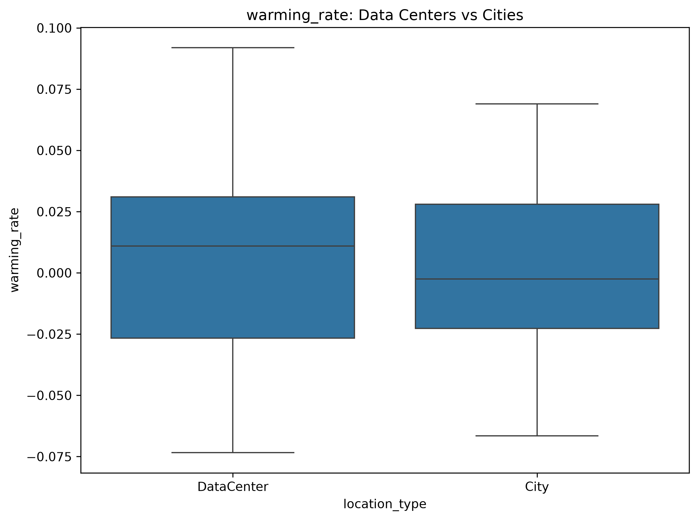
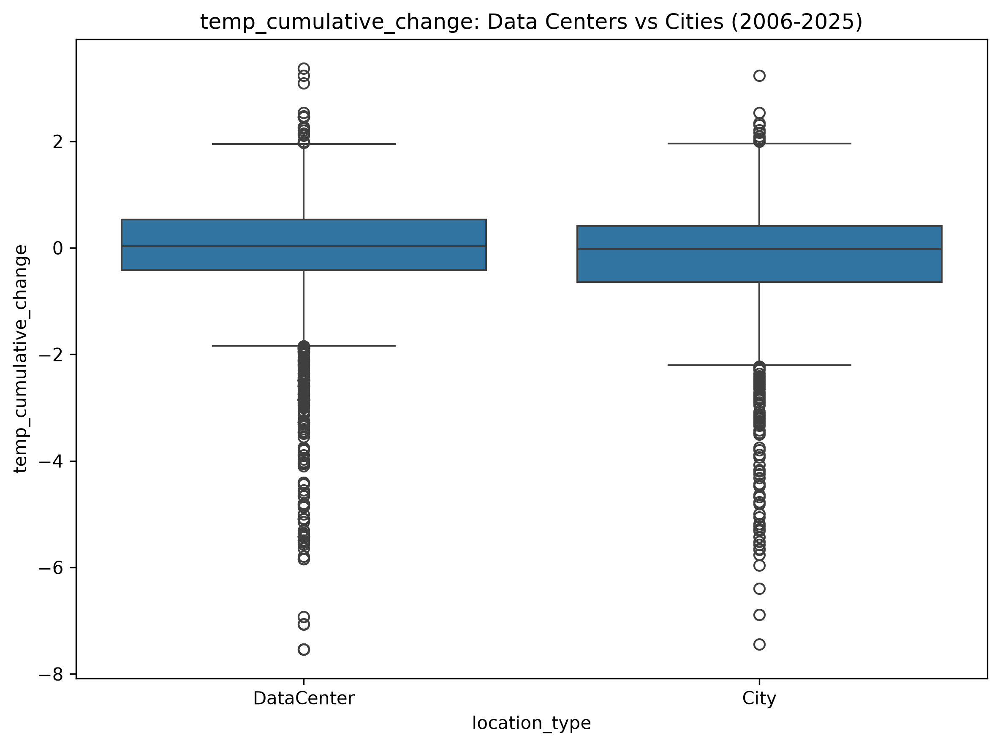
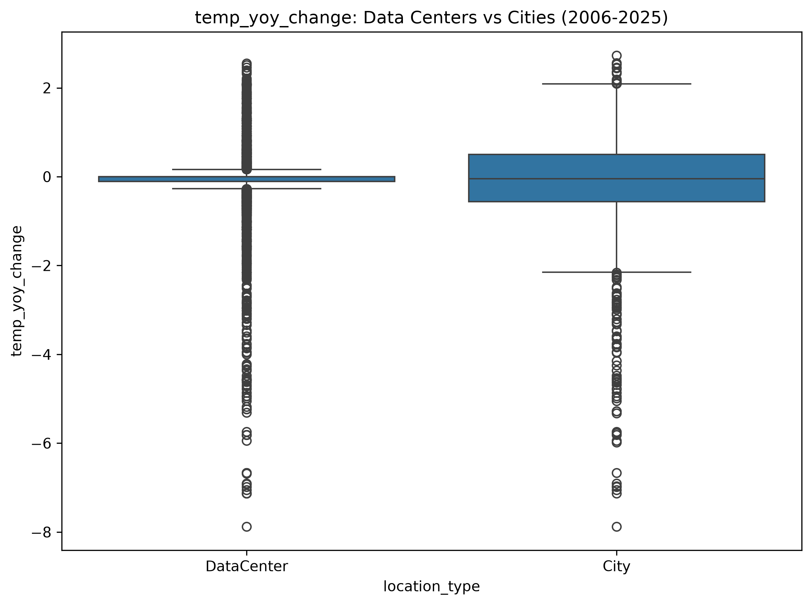
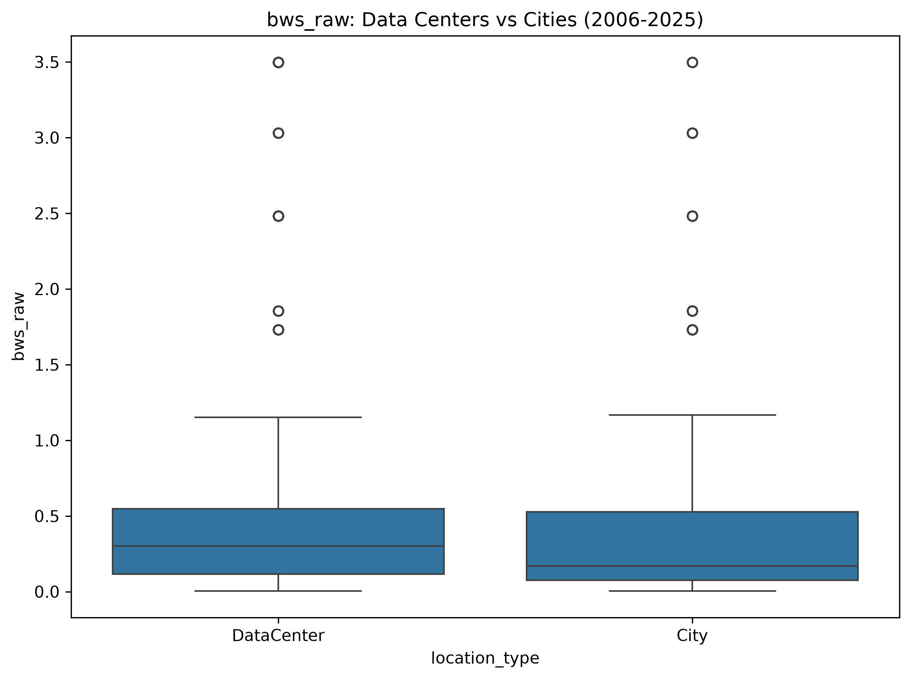
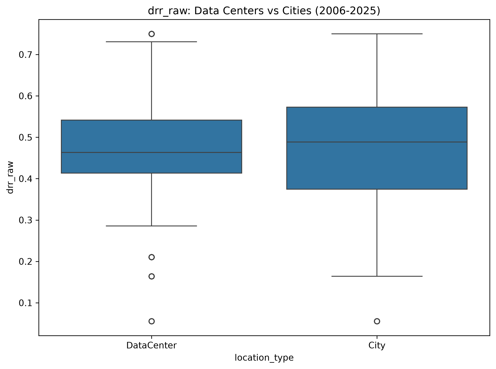
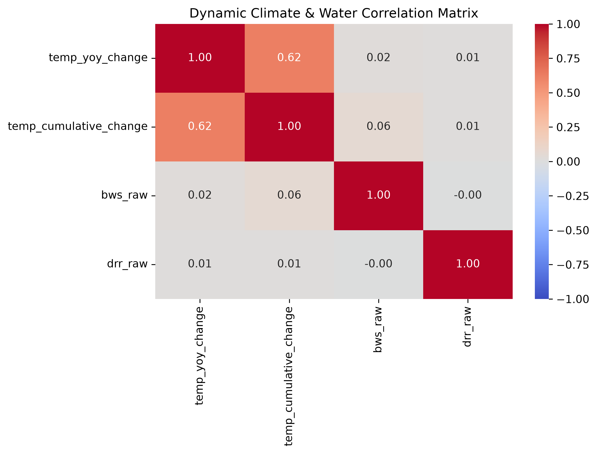
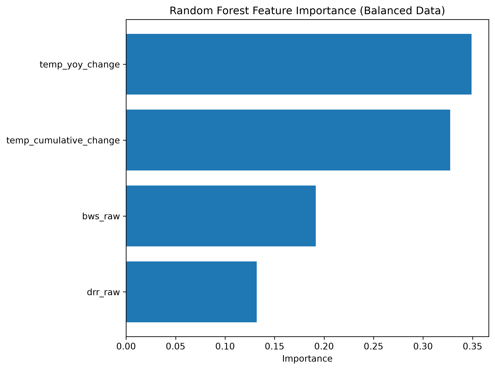
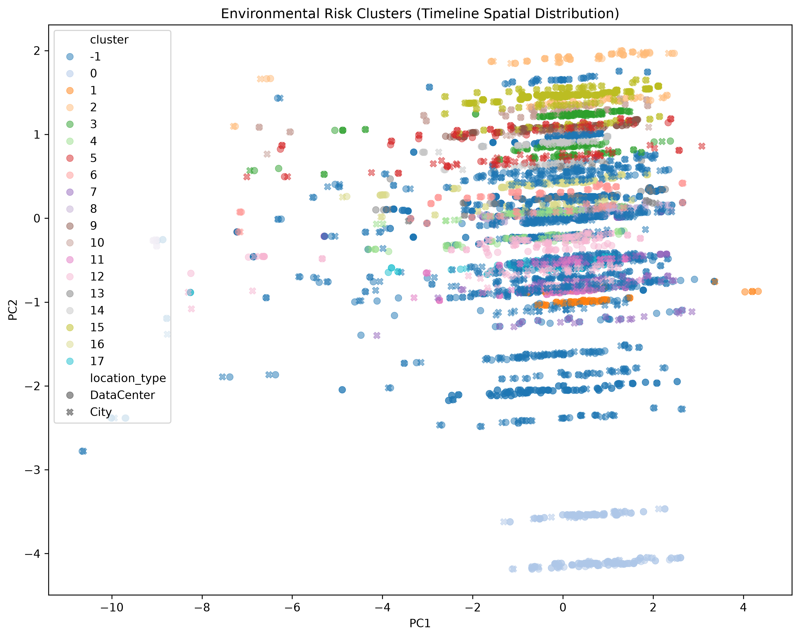

# ai-datacenters

The repository is inspired by the data heat island effect, first introduced in the following paper: 

https://arxiv.org/pdf/2603.20897

The current project focuses on 187 global AI data centers and their corresponding 92 nearby or enclosed city centers. More specifically, data centers refer to sites with large-scale computations or cloud operations. For each category, the following datasets are collected: 

* Geographic coordinates: latitudes and longitudes for spatial alignment
* Average yearly temperatures from 2006 to mid 2026
* Static hydrological risk indicators (baseline water stress and drought risk)

Data Sources

1. OpenStreetMap / Nominatim
   © OpenStreetMap contributors
   https://www.openstreetmap.org/copyright

2. Open-Meteo
   Weather data by Open-Meteo.com
   https://open-meteo.com/
   Licensed under CC BY 4.0

3. Aqueduct 4.0 (World Resources Institute)
   Kuzma et al. (2023), Aqueduct 4.0: Updated Decision-Relevant Global Water Risk Indicators
   World Resources Institute (WRI)
   Licensed under CC BY 4.0
   https://www.wri.org/aqueduct

The above data collection was performed using several libraries in Python, which are included under src. These include geopy, geopandas, sklearn, hdbscan, seaborn, matplotlib, requests and pandas.

Methods and techniques: 

The first step includes constructing spatiotemporal environmental datasets by merging the static hydrological risk indicators with the temperature time series using a coordinate-based spatial join. Accordingly, four variables are defined. These are:

* Year-over-year temperature change
* Long-term cumulative temperature deviation
* Baseline water stress
* Drought risk index

For analysing these variables, a combination of the following statistical and machine learning methods was applied:

* Non-parametric testing (Mann-Whitney U) to compare the distributions between the two groups.
* Correlation analysis
* PCA for dimensionality reduction
* Random forest classification (GroupKFold validation)
* HDBSCAN clustering to identify environmental clusters.

Findings and Conclusions: 

1- Significant statistical differences were observed between the two location types.

<table>
  <tr>
    <th align="center">Warming Rate</th>
    <th align="center">Temperature Cumulative Change</th>
    <th align="center">Year-over-Year (YoY) Change</th>
  </tr>
  <tr>
    <td></td>
    <td></td>
    <td></td>
  </tr>
</table>

All 4 variables exhibit statistically significant distributional differences between the two groups, with the strongest effect being observed in baseline water stress. In particular, data centers demonstrate a higher median, a higher upper quartile, and a high maximum for cumulative warming. Furthermore, data centers tend to exhibit a tighter distribution with reduced variability in YoY changes, while cities show a broader spread and a higher frequency of extreme fluctuations. 

<table>
  <tr>
    <th align="center">Baseline Water Stress (BWS)</th>
    <th align="center">Drought Risk (DRR)</th>
  </tr>
  <tr>
    <td></td>
    <td></td>
  </tr>
</table>

In addition, as demonstrated in the above two figures, baseline water stress is higher for data center locations than cities, while drought risk shows strong overlap with cities exhibiting larger variability.

2- Thermal and hydrological risks are largely uncorrelated.

Correlation analysis shows near-zero relationships between temperature variables and hydrological indicators.

3- Temperature variables dominate feature importance analysis predictions.

ML models identify temperature-based variables as the primary drivers for classification, accounting for roughly two thirds of total feature importance. Therefore, feature importance reflects model-specific predictive contribution.

4- Distinct environmental risk groups are present based on HDBSCAN analysis

HDBSCAN identifies multiple environmental risk clusters. These are: 

* an extreme hydrological-risk cluster  
* a large dominant cluster with moderate-risk conditions
* a large outlier cluster that contains mixed risk conditions

5- Random forest classification provided limited ability to separate classes. 

With Accuracy = 87% and City F1 = 0.08, this indicates that class imbalance was observed with the data centers class dominating, which affected the classification performance on the other group.

Author 

Dr. Basel Ali

